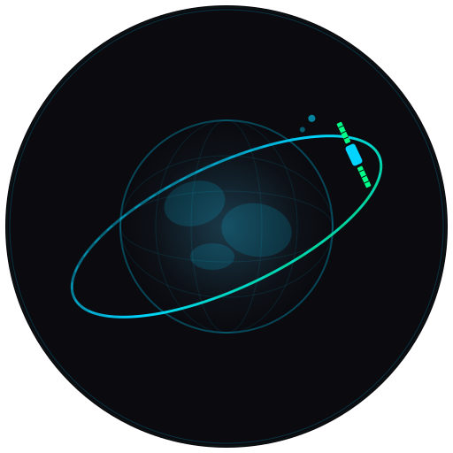

<p align="center">
  
</p>

<h1 align="center">🛰️ SpaceTracker Pro</h1>

<p align="center">
  <strong>Real-time International Space Station Tracking with 3D Visualization</strong>
</p>

<p align="center">
  <a href="#features">Features</a> •
  <a href="#demo">Demo</a> •
  <a href="#installation">Installation</a> •
  <a href="#deployment">Deployment</a> •
  <a href="#api-reference">API</a> •
  <a href="#contributing">Contributing</a>
</p>

<p align="center">
  
  
  
  
</p>

<p align="center">
  
</p>

---

## 🌟 Overview

**SpaceTracker Pro** is a modern, feature-rich web application that provides real-time tracking of the International Space Station (ISS). Built with cutting-edge web technologies, it offers an immersive 3D globe experience with accurate orbital mechanics, live position updates, and advanced prediction tools.

Whether you're a space enthusiast, educator, or developer, SpaceTracker Pro brings the wonder of space exploration right to your browser.

---

## ✨ Features

<table>
<tr>
<td width="50%">

### 🛰️ Real-time Tracking
- Live ISS position updates every 3 seconds
- Accurate orbital path visualization
- 3D ISS model with realistic positioning
- Velocity and altitude monitoring

</td>
<td width="50%">

### 🌍 Interactive Globe
- Full 3D Earth visualization
- Multiple map projections
- Layer management system
- Smooth animations and transitions

</td>
</tr>
<tr>
<td width="50%">

### 🔮 Prediction Tools
- **Time → Position**: Predict ISS location at any future time
- **Location → Passes**: Find when ISS will pass over your location
- Multi-day pass forecasting
- Elevation and duration calculations

</td>
<td width="50%">

### 🎥 Live Streaming
- Official NASA ISS video feeds
- Outer view (Earth from space)
- Inner view (inside the station)
- Full-screen viewing mode

</td>
</tr>
</table>

### Additional Features

| Feature | Description |
|---------|-------------|
| 📍 Location Search | Search any location and view on the globe |
| 🎨 Customizable Layers | Toggle base maps, overlays, and data layers |
| ⚙️ Settings Panel | Configure display options and preferences |
| 📱 Responsive Design | Works on desktop, tablet, and mobile |
| 🌙 Dark Theme | Space-inspired dark interface |
| ⌨️ Keyboard Shortcuts | Quick navigation with keyboard |

---

## 🚀 Demo

🌐 **Live Demo**: [Coming Soon - Deploy to Netlify]

### Quick Preview

```
┌─────────────────────────────────────────────────────────────┐
│  🛰️ SpaceTracker Pro                    [Layers] [Settings] │
├─────────────────────────────────────────────────────────────┤
│                                                             │
│                    🌍 Interactive 3D Globe                  │
│                                                             │
│         ╭──────╮                                            │
│         │ ISS  │ ← Real-time position                       │
│         ╰──────╯                                            │
│              ~~~~~~~~~ Orbital Path ~~~~~~~~~               │
│                                                             │
├─────────────────────────────────────────────────────────────┤
│  📍 Position: 45.2°N, 122.3°W  │  ⬆️ Alt: 420 km           │
│  ⚡ Velocity: 27,580 km/h      │  📍 Location: Over Pacific │
└─────────────────────────────────────────────────────────────┘
```

---

## 📦 Installation

### Prerequisites

- **Node.js** 14.0.0 or higher
- **npm** 6.0.0 or higher
- Modern web browser (Chrome, Firefox, Edge, Safari)

### Quick Start

```bash
# Clone the repository
git clone https://github.com/yourusername/iss-tracker.git

# Navigate to project directory
cd iss-tracker

# Install dependencies
npm install

# Start development server
npm run dev
```

The application will open automatically at `http://localhost:8080`

### Available Scripts

| Command | Description |
|---------|-------------|
| `npm run dev` | Start development server with hot reload |
| `npm start` | Start production server |
| `npm run build` | Build for production |
| `npm run lint` | Run ESLint |
| `npm run lint:fix` | Fix ESLint issues automatically |
| `npm run clean` | Clean build directory |

---

## 🌐 Deployment

### Deploy to Netlify

<details>
<summary><strong>Option 1: One-Click Deploy</strong></summary>

[](https://app.netlify.com/start)

</details>

<details>
<summary><strong>Option 2: GitHub Integration</strong></summary>

1. Push your code to GitHub
2. Go to [Netlify](https://app.netlify.com)
3. Click **"Add new site"** → **"Import an existing project"**
4. Connect your GitHub repository
5. Configure build settings:
   - **Build command**: *(leave empty)*
   - **Publish directory**: `.`
6. Click **Deploy**

</details>

<details>
<summary><strong>Option 3: Netlify CLI</strong></summary>

```bash
# Install Netlify CLI globally
npm install -g netlify-cli

# Login to Netlify
netlify login

# Deploy to production
netlify deploy --prod
```

</details>

### Configuration Files

| File | Purpose |
|------|---------|
| `netlify.toml` | Main Netlify configuration |
| `_redirects` | SPA routing fallback |

---

## 🏗️ Project Structure

```
iss-tracker/
├── 📄 index.html              # Main HTML entry point
├── 📁 styles/
│   └── main.css               # Global styles & design system
├── 📁 scripts/
│   ├── main.js                # Application entry point (ES Module)
│   ├── space-globe.js         # 3D globe controller
│   ├── layer-controller.js    # Map layer management
│   ├── settings-controller.js # Settings management
│   ├── search-controller.js   # Location search
│   ├── iss-data-manager.js    # Real-time ISS data
│   ├── prediction-manager.js  # Prediction calculations
│   └── stream-manager.js      # Live video streaming
├── 📁 images/
│   ├── ISS.dae                # 3D ISS model (Collada)
│   ├── ISS.png                # ISS texture
│   └── world.png              # Application icon
├── 📄 netlify.toml            # Netlify configuration
├── 📄 _redirects              # SPA routing
├── 📄 package.json            # Dependencies & scripts
└── 📄 README.md               # Documentation
```

---

## 🔧 Technology Stack

<table>
<tr>
<td align="center" width="100">

<br><strong>HTML5</strong>
</td>
<td align="center" width="100">

<br><strong>CSS3</strong>
</td>
<td align="center" width="100">

<br><strong>JavaScript</strong>
</td>
<td align="center" width="100">

<br><strong>Node.js</strong>
</td>
</tr>
</table>

### Libraries & Frameworks

| Library | Version | Purpose |
|---------|---------|---------|
| [WorldWind.js](https://worldwind.arc.nasa.gov/web/) | 1.7.0 | 3D globe visualization |
| [Satellite.js](https://github.com/shashwatak/satellite-js) | 4.1.3 | Orbital mechanics calculations |
| [TLE.js](https://github.com/davidcalhoun/tle.js) | 4.x | Two-Line Element parsing |
| [Knockout.js](https://knockoutjs.com/) | 3.4.2 | UI data binding |
| [Bootstrap](https://getbootstrap.com/) | 4.0.0 | Responsive components |
| [jQuery](https://jquery.com/) | 3.2.1 | DOM manipulation |

---

## 🔌 API Reference

### External APIs Used

| API | Endpoint | Purpose |
|-----|----------|---------|
| **Where The ISS At** | `api.wheretheiss.at/v1` | Real-time ISS position |
| **TLE API** | `tle.ivanstanojevic.me` | Two-Line Element data |
| **BigDataCloud** | `api.bigdatacloud.net` | Reverse geocoding |
| **Nominatim** | `nominatim.openstreetmap.org` | Location search |
| **REST Countries** | `restcountries.com/v3.1` | Country data |

### Rate Limits

- ISS Position API: ~50 requests/minute
- Geocoding: ~1 request/second
- TLE Data: ~100 requests/day

---

## ⚙️ Configuration

### Optional API Keys

For enhanced functionality, you can configure optional API keys:

```javascript
// scripts/main.js
const APP_CONFIG = {
  BING_API_KEY: "your-bing-maps-key",      // Optional: Enhanced map tiles
  MAPQUEST_API_KEY: "your-mapquest-key"    // Optional: Geocoding
};
```

Get your API keys:
- **Bing Maps**: [bingmapsportal.com](https://www.bingmapsportal.com/)
- **MapQuest**: [developer.mapquest.com](https://developer.mapquest.com/)

### Environment Variables (Netlify)

Set these in Netlify's environment variables for production:

| Variable | Description |
|----------|-------------|
| `BING_API_KEY` | Bing Maps API key |
| `MAPQUEST_API_KEY` | MapQuest API key |

---

## 🎨 Design System

### Color Palette

| Color | Hex | Usage |
|-------|-----|-------|
| 🟦 Space Black | `#0a0a0f` | Primary background |
| 🔵 Deep Space | `#0d1117` | Secondary background |
| 🩵 Electric Cyan | `#00d4ff` | Accent color |
| 🟢 Neon Green | `#00ff88` | Success states |
| ⚪ Cosmic White | `#f8fafc` | Primary text |

### Typography

| Font | Usage |
|------|-------|
| **Orbitron** | Headers, titles |
| **Exo 2** | Body text |
| **JetBrains Mono** | Data displays |

---

## 🐛 Troubleshooting

<details>
<summary><strong>Globe not loading</strong></summary>

- Check WebGL support: [get.webgl.org](https://get.webgl.org/)
- Try Chrome or Firefox
- Disable browser extensions
- Check console for errors

</details>

<details>
<summary><strong>ISS data not updating</strong></summary>

- Check internet connection
- API may be rate-limited (wait a few minutes)
- Check browser console for errors

</details>

<details>
<summary><strong>Location search not working</strong></summary>

- Nominatim API may be rate-limited
- Try a more specific search query
- Check for typos in location name

</details>

---

## 🤝 Contributing

Contributions are welcome! Please follow these steps:

1. **Fork** the repository
2. **Create** a feature branch: `git checkout -b feature/amazing-feature`
3. **Commit** your changes: `git commit -m 'Add amazing feature'`
4. **Push** to the branch: `git push origin feature/amazing-feature`
5. **Open** a Pull Request

### Code Style

- ES6+ JavaScript
- Modern CSS (no preprocessors)
- Semantic HTML5
- ESLint configuration included

---

## 📄 License

This project is licensed under the **MIT License** - see the [LICENSE](LICENSE) file for details.

---

## 🙏 Acknowledgments

- **[NASA](https://www.nasa.gov/)** - ISS data and imagery
- **[WorldWind](https://worldwind.arc.nasa.gov/)** - 3D globe technology
- **[OpenStreetMap](https://www.openstreetmap.org/)** - Geocoding services
- **Space enthusiasts worldwide** 🚀

---

<p align="center">
  <strong>Built with ❤️ for space exploration</strong>
</p>

<p align="center">
  <a href="#-spacetracker-pro">⬆️ Back to Top</a>
</p>
